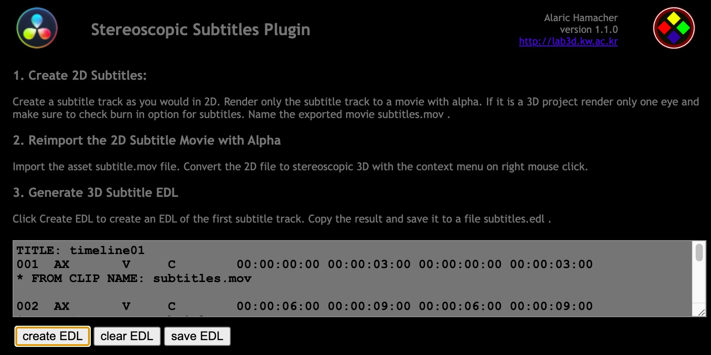

# Stereoscopic Subtitles Plugin

The purpose of this work is to elaborate a workflow for
stereoscopic subtitle creation. The proposed method is based on a workflow using Davinci Resolve and takes
advantage of its scripting features.

## Workflow Automation Plugin for Davinci Resolve.

1. Add regular 2D subtitles to a stereoscopic 3D project.
2. Render only the subtitles to a video with alpha.


<picture>
   
</picture>


3. Reimport the subtitle video as stereoscpic 3D
4. use the EDL generator to split the subtitles video track according to the subtitles.


<picture>
   
</picture>


5. Perform stereoscopic adjustment on the color page. Use stereoscopic preview mode (anaglyph).
6. use the XML generator to generate a DCDM stereosopic subtitle file with the content from the subtitle track and the convergence value from the video track transposed to the Zposition tag.


<picture>
   
</picture>


## Limitations and Disclaimer
The present version is at an early development stage. Please verify the results carefully.
VariableZ position is derived from the keyframed convergence. However, it is optional in the SMPTE specification.

## Installation

Copy the folder StereoscopicSubtitlePlugin to your system:
```
/Library/Application Support/Blackmagic Design/Davinci Resolve/Workflow Integration Plugins
```
If the folder Workflow Integration Plugins does not exist you need to create it there.
After restart the Plugin can be called via the menu Workspace - Workflow Integrations.

## Demo Files

The folder demo contains a Davinci Resolve Project archive to reproduce the workflow.

## Link to the Paper:
Background and explanation about the Plugin-can be found here:

https://doi.org/10.56581/IJLEMR.9.02.51-59

## Bibtex Reference for Quote:
```
@article{hamacher_digital_2024,
	title = {Digital {Cinema} {Stereoscopic} {Subtitle} {Workflow}},
	volume = {9},
	issn = {24554847},
	url = {http://www.ijlemr.com/papers/volume9-issue02/7-IJLEMR-88956.pdf},
	doi = {10.56581/IJLEMR.9.02.51-59},
	abstract = {Subtitles in Digital Cinema are well established for monoscopic formats. They are often used, when dubbing is not available such as film festivals and international arthouse distribution. A wide range of authoring tools is available and subtitles can easily be added in Digital Cinema Packages. This simple language version creation method facilitates international distribution of movies. Mastering of stereoscopic movies and subtitles however, requires specialized tools for visualization and authoring. It is therefore common to see stereoscopic movies with lower quality subtitles or no subtitles as all when the language versions are burned into the movie. This makes the creation of international language versions much more costly than for monoscopic movies. Although Digital Cinema standards specify monoscopic and stereoscopic subtitles, they are rarely applied because of a lack of affordable authoring tools. The purpose of this paper is to elaborate a workflow for stereoscopic subtitle creation. The proposed method is based on a workflow using Davinci Resolve and takes advantage of its scripting features.},
	language = {en},
	number = {2},
	urldate = {2025-01-29},
	journal = {International Journal of Latest Engineering and Management Research (IJLEMR)},
	author = {Hamacher, Alaric},
	month = feb,
	year = {2024},
	pages = {51--59},
	file = {Hamacher - 2024 - Digital Cinema Stereoscopic Subtitle Workflow.pdf:/Users/alarix/Zotero/storage/RCNWTHCD/Hamacher - 2024 - Digital Cinema Stereoscopic Subtitle Workflow.pdf:application/pdf},
}
```
